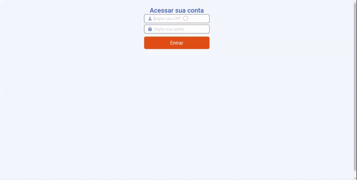

<h1 align="center">
  
</h1>

<h3 align="center">
  Application for Inovação Treinamentos
</h3>

## Clients

### Site

  

  <strong>Web</strong>
   

  
  

  

  <strong>Mobile</strong>
   

   
  

### Student

  

  <strong>Web</strong>
   

  
  

  

  <strong>Mobile</strong>
   

   
  

### Admin

  

### Server

[Insomnia Template](./server/Insomnia_2020-06-16.json)
